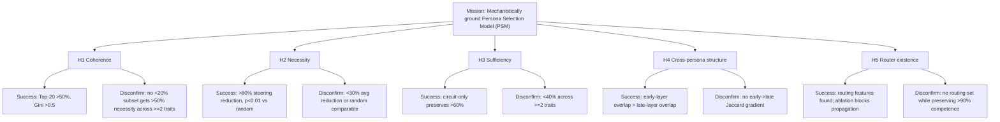
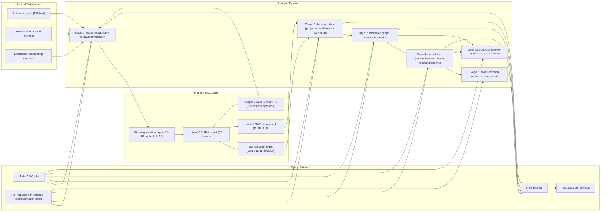
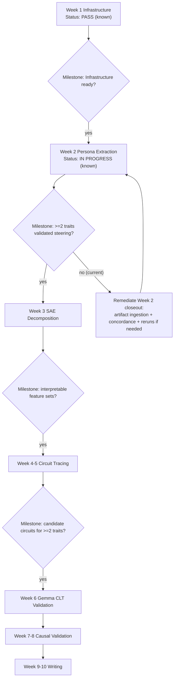
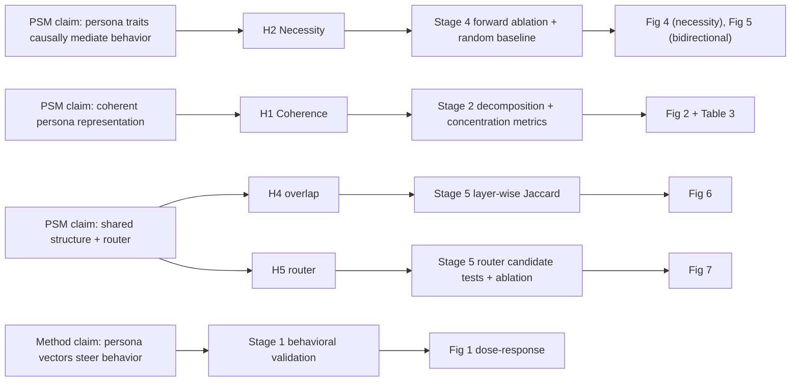

# Persona Circuits Experiment Diagram Pack

**As of:** 2026-02-26T08:21:42-0600 (local) / 2026-02-26T14:21:42Z (UTC)

## Evidence Legend

- `known`: directly verified in local artifacts/docs
- `observed`: directly observed from live command output in this session
- `inferred`: derived from known/observed evidence
- `unknown`: not currently evidenced

---

## 1) Mission, Hypotheses, and Disconfirmation Map



---

## 2) End-to-End Technical Architecture



---

## 3) Program Execution Flow and Go/No-Go Gates



---

## 4) Current Stage Snapshot (Evidence-Tagged)

```mermaid
flowchart LR
    subgraph S1["Stage 1 / Week 2"]
      S1A["Vectors extracted for 3 traits\nknown"]
      S1B["Behavioral closeout not complete\nknown"]
      S1C["Sycophancy upgraded artifact available\nknown"]
      S1D["Evil + Hallucination upgraded primary JSON missing locally\nknown"]
      S1E["Timeout/cancellation pattern likely in primary tranche\ninferred"]
    end

    subgraph S2["Stage 2 Readiness"]
      S2A["Token-level reconstruction gate: pass\nknown"]
      S2B["Hook-integrity gate: pass\nknown"]
      S2C["Cross-source overlap precondition: pass (layers 11,15)\nknown"]
      S2D["Multi-seed reconstruction rerun still pending\nknown"]
    end

    subgraph S34["Stage 3/4"]
      S3A["Attribution/ablation scaffold artifact exists\nknown"]
      S3B["No real attribution/ablation causal runs yet\nunknown"]
    end

    S1A --> S1B --> S1C --> S1D --> S1E --> S2A --> S2B --> S2C --> S2D --> S3A --> S3B
```



---

## 5) Trait-Level Evidence Matrix (ASCII)

```text
+---------------------------+------------------------------+----------------------------------------+---------------------------------------------+------------------------------------+
| Trait axis                | Vector extraction            | Behavioral closeout state              | Extraction-free overlap (reanalysis)         | Week 3 candidacy stance            |
+---------------------------+------------------------------+----------------------------------------+---------------------------------------------+------------------------------------+
| sycophancy                | Extracted (known)            | Available upgraded artifact fails gates | weak positive overlap; sign-test strong      | candidate, pending Week2 closeout  |
|                           |                              | in preflight ingestion (known)          | (known)                                      |                                    |
+---------------------------+------------------------------+----------------------------------------+---------------------------------------------+------------------------------------+
| evil -> machiavellian     | Extracted (known)            | final primary upgraded artifact missing | moderate positive overlap; sign-test strong  | reframed candidate axis (inferred) |
| disposition framing       |                              | locally (known)                         | (known)                                      | harmful-content framing disconfirmed|
+---------------------------+------------------------------+----------------------------------------+---------------------------------------------+------------------------------------+
| hallucination             | Extracted (known)            | final primary upgraded artifact missing | null overlap; fails overlap-gradient policy  | control/instruction-dynamics lane  |
|                           |                              | locally (known)                         | (known)                                      | unless rerun changes evidence      |
+---------------------------+------------------------------+----------------------------------------+---------------------------------------------+------------------------------------+
```

---

## 6) Claim-to-Experiment Traceability Skeleton



---

## 7) Current Critical Path (ASCII)

```text
[NOW] Week 2 closeout incomplete
  |
  +--> Confirm final trait artifacts exist locally for sycophancy/evil/hallucination
  |
  +--> Run deterministic ingestion with explicit trait->artifact map
  |
  +--> Manual 5-example judge concordance spot-check
  |
  +--> Re-run prelaunch gap checks on selected combos
  |
  +--> If >=2 traits pass Week2 validation gates -> unlock Week3 decomposition claims
  |
  '--> Otherwise: timeout-aware partitioned reruns + progress logging, then re-evaluate
```

---

## 8) Live Status Note (Command-Time Snapshot)

```text
2026-02-26T08:21:42-0600:
- modal app list --json returned no currently listed persona-circuits week2 apps (observed)
- local results directory still has only two upgraded sycophancy JSON files and no upgraded evil/hallucination JSON files (known)
- therefore Week2 primary closeout remains non-claimable until deterministic ingestion over complete trait artifacts (inferred)
```

